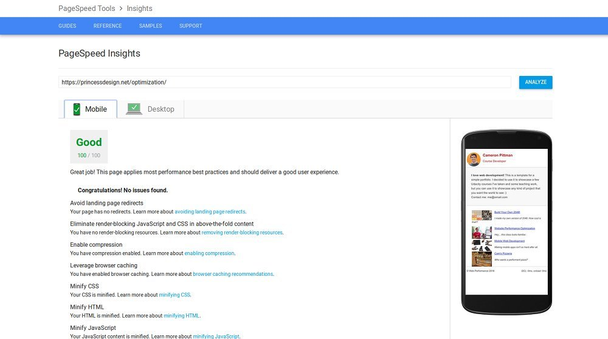
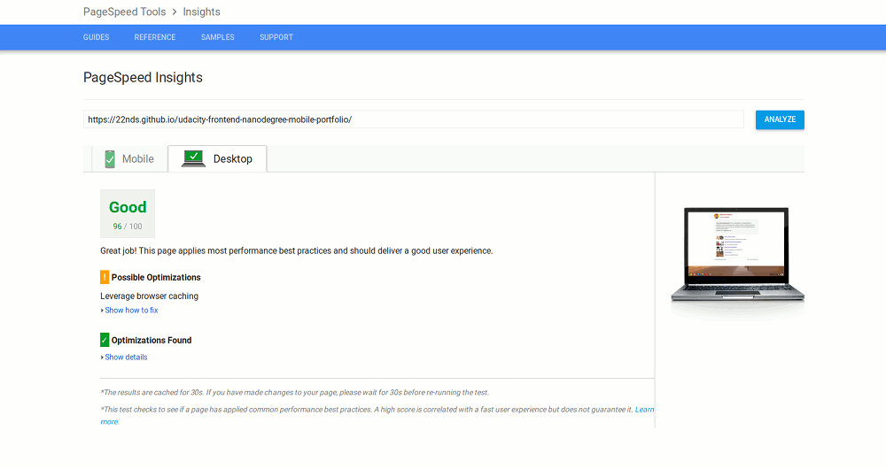

# Optimized versions
[My server](https://princessdesign.net/optimization/) Mobile: 100/100
Desktop: 100/100

Mobile: 94/100
Desktop: 96/100
[GitHub](https://22nds.github.io/udacity-frontend-nanodegree-mobile-portfolio/)


## Final version
* in folder /docs
* https://princessdesign.net/optimization/
* https://22nds.github.io/udacity-frontend-nanodegree-mobile-portfolio/


## Setup
```
npm init
npm install
```

## Changes
* Automatization of processes - Gulp (minification of CSS, HTML, JS)
* Removed Google Analytics from the script as I don't need it
* Changed Copyright date to 2018

## Optimizations
* Minified all css files
* Minimized all html
* Minimized all js
* Inline css of style.css
* Resized pizzeria.jpg image to 100px width
* Optimized all images
```
convert puzzle.jpg -sampling-factor 4:2:0 -strip -quality 85 -interlace JPEG -colorspace sRGB puzzle_converted.jpg
```
* Enabled gzip in .htaccess
* Enabled caching on the server in .htaccess
* Added Google font Open Sans to server